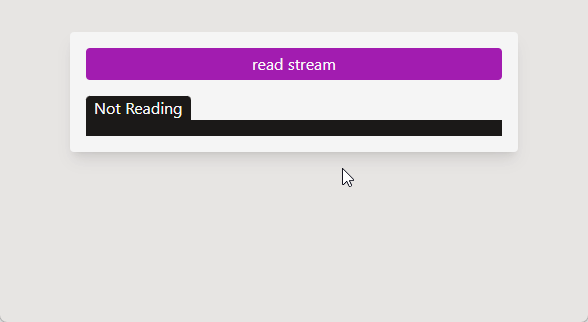

# Next.js streams API example

Streams API website made with Next.js.



```typescript
// src/pages/api/stream.ts
export default function handler(req, res) {
  res.setHeader("Content-Type", "text/event-stream; charset=utf-8");

  res.write("Starting stream...");
  res.write("Send data 1.");
  res.write("Send data 2.");
  res.write("Send data 3.");
  res.write("End stream.");

  res.end();
}

// src/pages/index.tsx
async function readStream() {
  const response = await fetch("/api/stream");

  const reader = response.body.pipeThrough(new TextDecoderStream()).getReader();
  while (true) {
    const { done, value } = await reader.read();
    if (done) {
      break;
    }
    console.log(value);
  }
}
```

### Send the response as stream

`res.write` sends a chunk of response body[^1]. Use it multiple times to send response as stream.

### Read the reponse as stream

`response.body.getReader().read()` returns a Promise.

- If a chunk is available, Promise will be fulfilled with `{ done: false, value: chunk }`.
- If the stream becomes closed, Promise will be fulfilled with `{ done: true, value: undefined }`.
- If the stream becomes erroed, Promise will be rejected with the error[^2].

Use `response.body.pipeThrough(new TextDecoderStream())` to decode `Uint8Array` into `string`[^3].

Asynchronously iterating over `response.body: ReadableStream` is currently only supported in Firefox[^4](2023-04).

[^1]: https://nodejs.org/api/http.html#responsewritechunk-encoding-callback
[^2]: https://developer.mozilla.org/en-US/docs/Web/API/ReadableStreamDefaultReader/read#return_value
[^3]: https://developer.chrome.com/articles/fetch-streaming-requests
[^4]: https://developer.mozilla.org/en-US/docs/Web/API/ReadableStream#browser_compatibility
